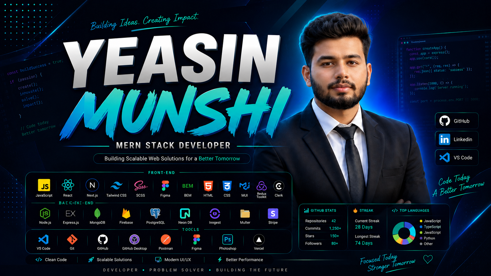

 

<h1 align="center">Hi 👋, I'm Yeasin Munshi</h1>
<h3 align="center">🚀 MERN Stack Developer | Full Stack JavaScript Developer</h3>

---

## 👨‍💻 About Me

I'm **Yeasin Munshi**, a passionate **MERN Stack Developer** from **Bangladesh 🇧🇩**.

💡 I specialize in building **responsive, scalable, and modern web applications** using JavaScript technologies.

✨ I enjoy transforming ideas into real-world products, solving challenging problems, and continuously learning new technologies.

- 🔭 Currently Working on **MERN Stack Projects**
- 🌱 Currently Learning **Advanced Backend & Database Technologies**
- 💬 Ask me about **React, Next.js, Node.js, Express, MongoDB**
- ⚡ Fun Fact: *I love building clean UI and scalable backend systems.*

---

## 🎨 Front-End Development

---

## ⚙️ Back-End Development

---

## 🛠️ Tools

---

## 📊 GitHub Stats

  
  

  

  

## 🏆 GitHub Trophies

## 🚀 Featured Projects

| Project | Description | Live |
|---------|-------------|------|
| 🩺 Doctor Portfolio | Responsive Doctor Portfolio Website | [Live Demo](https://your-link.com) |
| 🛒 E-Commerce | MERN Stack Ecommerce Application | [Live Demo](https://your-link.com) |
| 💬 Chat App | Real-Time Chat Application using Socket.IO | [Live Demo](https://your-link.com) |
| 📰 News Portal | Modern News Website | [Live Demo](https://your-link.com) |

## 📚 Currently Learning

- Next.js App Router
- TypeScript
- Prisma ORM
- PostgreSQL
- Docker
- AWS
- Microservices
- System Design

## 🎯 2026 Goals

✔ Build SaaS Applications

✔ Master System Design

✔ Learn AWS & Docker

✔ Contribute to Open Source

✔ Become Senior Full Stack Developer

## 💻 Coding Profiles

## 🌐 Portfolio

## ☕ Support Me

## 🐍 Contribution Snake

## 📫 Connect with Me

